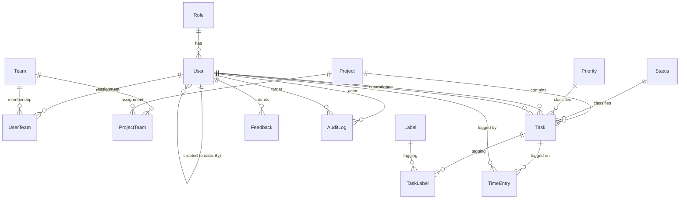

# Planora – ER Model

Source of truth: `prisma/schema.prisma`. All primary keys are UUIDs; most entities carry
`createdAt` / `updatedAt` timestamps. Names in the database and API are English; the visible
UI is Croatian.

## Entity–relationship diagram

## Entities

| Entity        | Purpose                                                              |
| ------------- | -------------------------------------------------------------------- |
| `Role`        | Access role (`ADMIN`, `PROJECT_MANAGER`, `DEVELOPER`, `TESTER`).     |
| `User`        | Application account. `passwordHash` nullable before activation.      |
| `Team`        | Group of users.                                                      |
| `UserTeam`    | M:N join between `User` and `Team` (composite PK).                   |
| `Project`     | A project with a start date and optional end date.                   |
| `ProjectTeam` | M:N join between `Project` and `Team` (composite PK).                |
| `Task`        | Work item within a project; has status, priority, optional dates.    |
| `Status`      | Task workflow state (`TODO`, `IN_PROGRESS`, `IN_REVIEW`, `DONE`).    |
| `Priority`    | Task priority (`LOW`, `MEDIUM`, `HIGH`, `CRITICAL`).                 |
| `Label`       | Reusable tag with optional color.                                    |
| `TaskLabel`   | M:N join between `Task` and `Label` (composite PK).                  |
| `TimeEntry`   | Time logged by a user on a task; `durationMinutes` server-computed.  |
| `Feedback`    | User feedback with optional rating and attachment URL.               |
| `AuditLog`    | Security-relevant events (actor, optional target, action, metadata). |

## Key constraints & indexes

- **Unique:** `User.email`, `Role.name`, `Status.name`, `Priority.name`, `Label.name`.
- **Composite PKs:** `UserTeam(userId, teamId)`, `ProjectTeam(projectId, teamId)`,
  `TaskLabel(taskId, labelId)`.
- **Indexes:** foreign keys and common filter columns are indexed (e.g. `Task.projectId`,
  `Task.statusId`, `Task.priorityId`, `Task.assigneeId`, `TimeEntry.entryDate`,
  `AuditLog.action`, `AuditLog.createdAt`, `User.accountStatus`).

## Referential actions (`onDelete`)

- `User.role` → **Restrict** (a role in use cannot be deleted).
- `User.createdBy` → **SetNull** (keep users if their creator is removed).
- `Task.status` / `Task.priority` / `Task.createdBy` → **Restrict**.
- `Task.assignee` → **SetNull** (unassign on user delete).
- Join tables (`UserTeam`, `ProjectTeam`, `TaskLabel`) and `TimeEntry` → **Cascade**.
- `Task.project` → **Cascade** (deleting a project removes its tasks).
- `AuditLog.actor` → **Cascade**, `AuditLog.target` → **SetNull**.

## Business rules enforced outside the schema

- `TimeEntry`: `endTime` must be after `startTime`; `durationMinutes` is computed on the
  server and never trusted from the client (validated with Zod in the backend layer).
- `Feedback.rating`: validated to an allowed range when present.
- Audit metadata must never contain passwords, hashes, temporary passwords, or session values.
